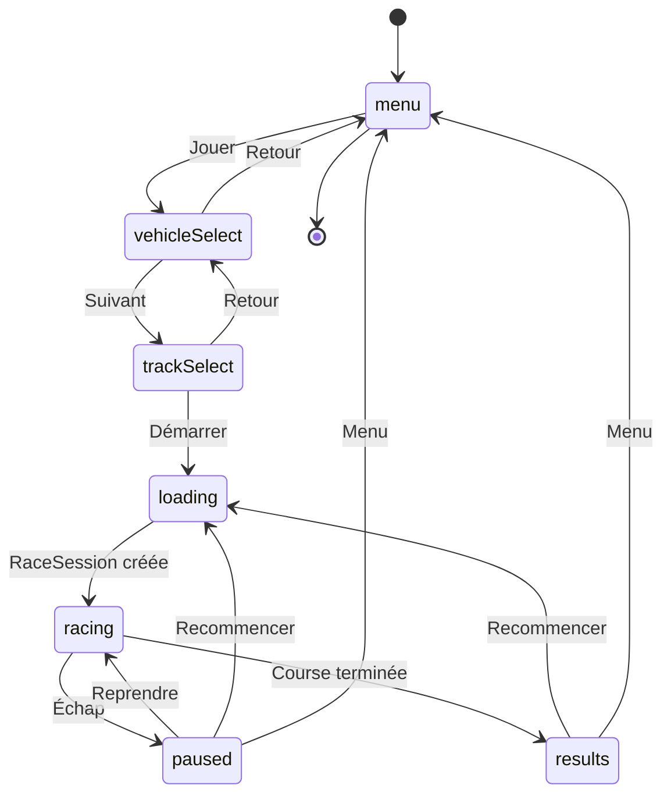
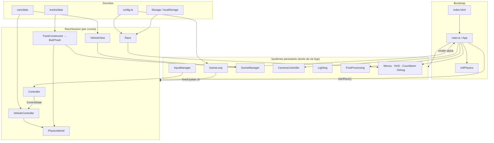
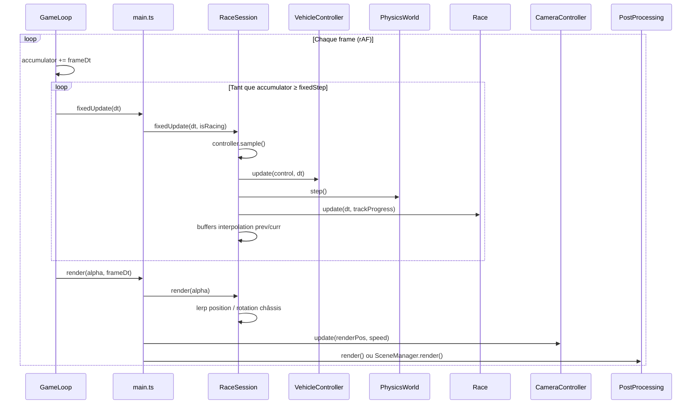
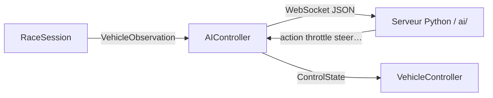

## Start project

cd game
npm install
npm run dev

---

## Architecture

Jeu de course 3D web (style Trackmania) construit avec **Vite**, **Three.js** (rendu) et **Rapier.js** (physique). Le point d'entrée `main.ts` orchestre les systèmes persistants ; chaque course est encapsulée dans une `RaceSession` jetable.

### Stack

| Couche      | Technologie                                 |
| ----------- | ------------------------------------------- |
| Build       | Vite + TypeScript                           |
| Rendu       | Three.js (WebGL, post-processing optionnel) |
| Physique    | Rapier 3D (WASM, véhicule raycast)          |
| UI          | DOM + CSS (`ui/`)                           |
| Persistance | `localStorage` (meilleurs temps)            |
| IA (prévu)  | WebSocket → serveur Python (`ai/`)          |

### Flux applicatif

### Architecture runtime

### Boucle de jeu

La simulation physique tourne à **pas fixe** (60 Hz) ; le rendu suit la fréquence d'affichage avec **interpolation** (`alpha`) entre deux états physiques.

### Couplage des responsabilités

| Module              | Rôle                                                                                         |
| ------------------- | -------------------------------------------------------------------------------------------- |
| `main.ts`           | Machine à états UI, cycle de vie des sessions, câblage global                                |
| `RaceSession`       | Frontière simulation/rendu : construit le monde, avance la physique, expose l'état interpolé |
| `Controller`        | Découple l'entrée (humain / IA) de `VehicleController` via `ControlState`                    |
| `TrackConstructor`  | Visuel + colliders + courbe centrale + spawn + progression sur piste                         |
| `Race`              | Règles de course (tours, chrono, delta, records) indépendantes de la physique                |
| `VehicleController` | Seul module qui parle à Rapier pour le véhicule                                              |
| `VehicleView`       | Représentation Three.js synchronisée avec la physique                                        |

### Intégration IA (prévue)

Chaque frame, `RaceSession` peut pousser une observation (position, capteurs raycast, progression) vers `AIController`, qui relaie les actions reçues du serveur externe.

## Prochaines étapes : 

- Track : changements d'altitude, des virages inclinés, un saut/une rampe, et une boucle ou un boost pad si possible.
- **Plateformes de boost** et **surfaces modifiant la vitesse** (par exemple, zones à faible adhérence / de terre) en option.
- **4 roues** avec paramètres configurables : suspension travel, stiffness, damping, friction. Animation des roues : rotation de direction sur les roues avant + rotation de roulement sur toutes les roues en fonction de la vitesse.
- Faire un menu système solaire, l'utilisateur peut choisir la planète et, pour chaque planète, il y aura un stade d'entrainement pour tester la gravité, les mécaniques de jeu etc. et plusieurs circuits dans cet environnement. La dernière track du jeu sera un parcours multi planètes à la course arc en ciel Mariokart avec une fin dans le soleil ou trou noir. 
- Ghost car (meilleur temps) : Enregistrement de la position/rotation toutes les 100ms via un `GhostRecorder`, Stockage dans `localStorage` (format JSON compressé), Replay transparent (mesh semi-transparent) pendant la course suivante.
- Effets particules : Fumée de pneus au freinage/dérapage, Poussière au dépassement des bordures
- **Système de checkpoints :** A mettre dans src/track/Checkpoint.ts. Volumes de déclenchement invisibles ; doivent être franchis dans l'ordre ; chronométrage intermédiaire (écart en temps réel par rapport au record personnel (vert/rouge)). Permettra le respawn si reset (touche R) ou si voiture retournée.
- **Prise en charge de la manette** via l'API Gamepad (direction/accélérateur analogiques) — important pour les sensations. Rendre la couche d'entrée abstraite afin que le clavier et la manette fournissent les mêmes valeurs de contrôle.
- Minimap (facultatif, top-down orthographic render sur render target séparé)
- frein arrière différentiel pour le handbrake (touche Space)
- Appui aérodynamique/traînée aérodynamique affectant la maniabilité à grande vitesse.
- Audio/Musique/Effet sonores
- Prévoir un cycle jour/nuit 
- Le circuit est un GLB unique exporté depuis Blender/Sketchfab. Nommer les meshes : `Track_Road`, `Track_Wall`, `Track_Decoration_*`, `Track_Ramp_*`
- **Contrôle de l'assiette en vol** réglage de l'assiette et du roulis en plein vol, à la manière de Trackmania.
- Respawn
- Détection de voiture retournée pendant > 2s
- Respawn au début du circuit avec vitesse nulle (animation de fondu)

## Notes d'intégration Sketchfab

Lors de l'import d'un modèle Sketchfab :
1. Télécharger en format **glTF** (pas FBX, pas OBJ)
2. Vérifier que les textures sont bien packagées dans le GLB (`Export as GLB`)
3. Dans Blender : recentrer l'origine, appliquer les transformations (`Ctrl+A → All Transforms`), réorienter si nécessaire (`Y vers le haut = Z-up dans Three.js`)
4. Exporter avec Draco compression (`Blender glTF exporter → Geometry → Draco`)

## Questions : 

TrackAI
Demander quel algorithme de Reinforcement Learning est le plus adapté à ce jeu 
